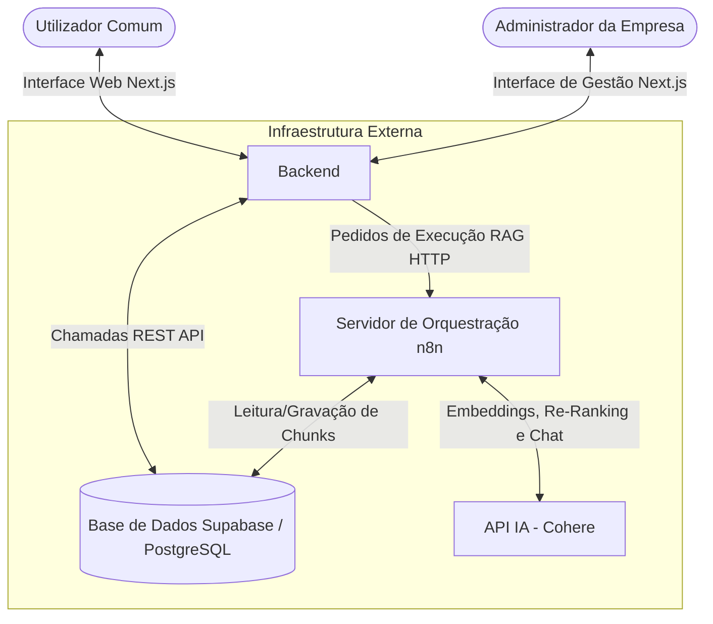
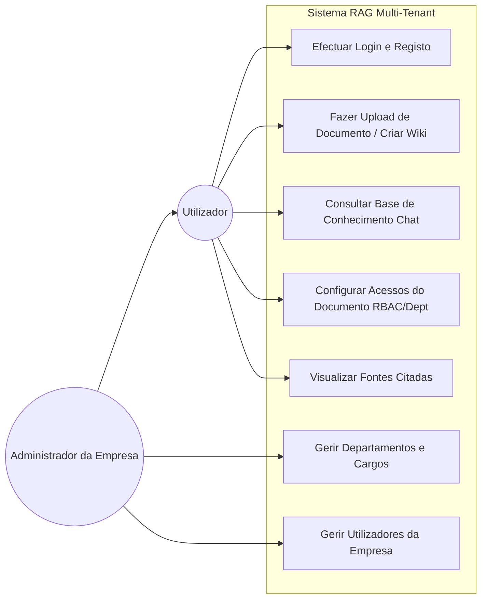
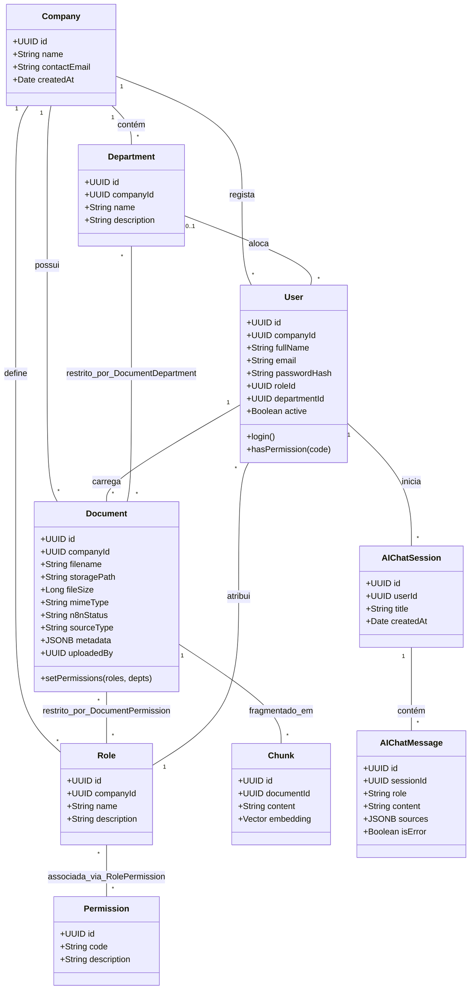
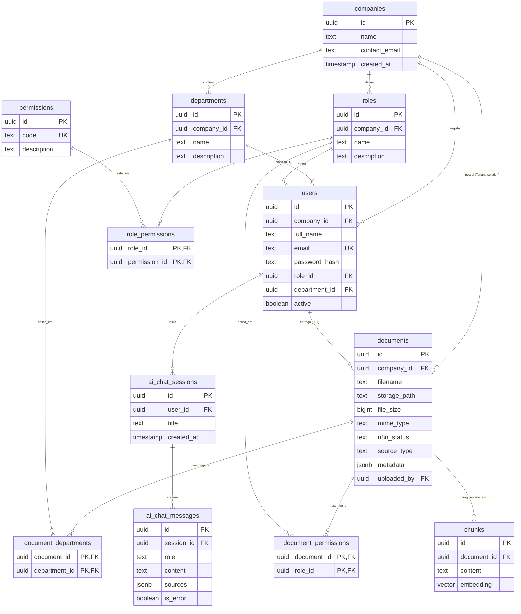
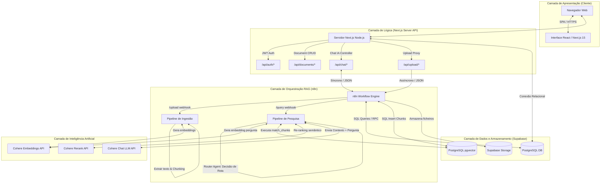

\clearpage

# 4. Resultados da Pesquisa

## 4.1. Apresentação e Análise dos Resultados

### 4.1.1. Metodologia de Desenvolvimento

O desenvolvimento do protótipo funcional deste trabalho seguiu uma abordagem metodológica baseada no modelo de prototipagem rápida e desenvolvimento incremental. Esta escolha justifica-se pela necessidade de validar continuamente os pipelines de processamento de linguagem natural e a integração entre diferentes serviços (Next.js, n8n e Supabase) antes da consolidação final do sistema.

O ciclo de desenvolvimento estruturou-se em quatro fases iterativas:
1. **Especificação e Desenho da Base de Dados:** Definição do esquema relacional de múltiplos inquilinos (*multi-tenant*) e sua posterior extensão para suportar vectores de características (*embeddings*) via extensão `pgvector`.
2. **Construção e Integração dos Pipelines RAG:** Desenvolvimento dos fluxos de ingestão de dados e pesquisa semântica através da ferramenta de automação visual n8n, assegurando uma separação clara entre a camada de aplicação e a camada de inteligência artificial.
3. **Desenvolvimento da Interface e API:** Construção do frontend e endpoints em Next.js, integrando autenticação baseada em tokens JWT e conectividade ao Supabase.
4. **Implementação de Controlos de Acesso:** Parametrização das regras de controlo de acesso baseado em papéis (RBAC) e por departamentos, culminando com a criação da função customizada `match_chunks()` para busca semântica segura.

Esta abordagem permitiu adaptar as componentes do software de forma flexível à medida que as restrições de conectividade e desempenho da API externa de Inteligência Artificial eram identificadas e mitigadas.

### 4.1.2. Requisitos

A especificação dos requisitos seguiu a norma ISO/IEC 25010 para a qualidade de produto de software, dividindo-se entre os requisitos que descrevem o comportamento funcional esperado pelo utilizador final e os requisitos de qualidade que impõem restrições técnicas ao comportamento do sistema.

#### 4.1.2.1. Requisitos Funcionais

Os Requisitos Funcionais (RF) definem os serviços que o sistema deve fornecer aos utilizadores. A Tabela 4.1 descreve os requisitos funcionais prioritários identificados para o protótipo.

| Identificador | Requisito Funcional | Descrição |
|:---|:---|:---|
| **RF-01** | Autenticação e Multi-tenancy | O sistema deve permitir que novos utilizadores registem a sua organização (*tenant*) e façam login num ambiente de dados estritamente isolado. |
| **RF-02** | Gestão de Departamentos | O utilizador administrador deve ser capaz de criar, ler, actualizar e eliminar os departamentos internos da empresa. |
| **RF-03** | Gestão de Cargos e Permissões | O administrador deve poder criar cargos organizacionais e associar-lhes permissões específicas do sistema (ex: visualização, upload, eliminação). |
| **RF-04** | Upload de Conteúdo e Documentos | O sistema deve suportar o upload de documentos de texto (PDFs, TXT) e permitir a introdução manual de conhecimento (artigos/páginas de Wiki), catalogando-os sob a classificação `source_type`. |
| **RF-05** | Configuração de Acesso a Conteúdo | O utilizador que realiza o upload deve poder limitar o acesso do documento ou página Wiki a departamentos específicos e a cargos específicos. |
| **RF-06** | Pesquisa Inteligente (Chat RAG) | O utilizador deve poder submeter perguntas em linguagem natural na interface de chat e obter uma resposta baseada no contexto dos documentos a que tem acesso. |
| **RF-07** | Atribuição de Fontes | A interface de chat da IA deve listar de forma clara os documentos de origem utilizados pelo LLM para sintetizar a resposta, permitindo a validação da informação. |
| **RF-08** | Gestão de Utilizadores | O administrador deve poder gerir os utilizadores da empresa, associando-os a um departamento e a um cargo específico. |

Table: Tabela 4.1: Requisitos Funcionais do Sistema. Fonte: Elaboração própria.

#### 4.1.2.2. Requisitos Não Funcionais

Os Requisitos Não Funcionais (RNF) especificam critérios que qualificam o funcionamento do sistema. A Tabela 4.2 apresenta os requisitos não funcionais.

| Identificador | Categoria | Descrição |
|:---|:---|:---|
| **RNF-01** | Segurança (Isolamento) | O isolamento entre diferentes empresas (*tenants*) deve ser garantido nativamente ao nível da base de dados através de políticas de *Row Level Security* (RLS) no PostgreSQL. |
| **RNF-02** | Desempenho (Pesquisa) | O tempo médio de resposta do pipeline de busca semântica e geração de resposta da IA não deve ultrapassar os 5 segundos sob condições estáveis de conectividade à internet. |
| **RNF-03** | Compatibilidade Linguística | O modelo de embeddings utilizado pelo sistema deve possuir suporte nativo e optimizado para a língua portuguesa para assegurar a relevância das pesquisas vectoriais. |
| **RNF-04** | Usabilidade (Interface) | A interface deve apresentar-se responsiva, fluida e incluir transições e animações visuais curtas para guiar a navegação do utilizador (*Framer Motion*). |
| **RNF-05** | Disponibilidade e Extensibilidade | A lógica de ingestão documental e recuperação RAG deve correr numa infraestrutura modular externa (n8n), facilitando a adição de novos conectores sem necessidade de recompilar o frontend Next.js. |

Table: Tabela 4.2: Requisitos Não Funcionais do Sistema. Fonte: Elaboração própria.

### 4.1.3. Modelagem do Sistema

A modelagem gráfica do sistema foi elaborada recorrendo à linguagem UML (*Unified Modeling Language*), mapeando a estrutura lógica de interacção e o comportamento dos componentes do software.

#### 4.1.3.1. Diagrama de Contexto

O Diagrama de Contexto define a fronteira entre a aplicação desenvolvida e as entidades ou sistemas externos com os quais interage directamente para assegurar as funcionalidades requeridas.



**Figura 4.1:** Diagrama de Contexto do Sistema. Fonte: Elaboração própria.

#### 4.1.3.2. Diagrama de Casos de Uso

O Diagrama de Casos de Uso detalha as interacções dos actores principais (Utilizador e Administrador) com o sistema, mapeando o escopo funcional do protótipo desenvolvido.



**Figura 4.2:** Diagrama de Casos de Uso do Sistema. Fonte: Elaboração própria.

#### 4.1.3.3. Especificação dos Casos de Uso

A especificação detalhada dos casos de uso principais do sistema fornece uma descrição passo-a-passo das acções executadas pelos actores e as correspondentes reacções do sistema. A Tabela 4.3 especifica o caso de uso principal de Pesquisa Inteligente.

+--------------------------+----------------------------------------------------------------------------------+
| Campo                    | Descrição                                                                        |
+==========================+==================================================================================+
| **Caso de Uso:**         | UC3 — Consultar Base de Conhecimento (Chat)                                      |
+--------------------------+----------------------------------------------------------------------------------+
| **Actor Principal:**     | Utilizador                                                                       |
+--------------------------+----------------------------------------------------------------------------------+
| **Pré-condições:**       | Utilizador autenticado e associado a uma empresa, departamento e cargo activo.   |
+--------------------------+----------------------------------------------------------------------------------+
| **Fluxo Principal:**     | 1. O utilizador acede à vista "Chat Inteligente" no menu lateral.                |
|                          |                                                                                  |
|                          | 2. O utilizador escreve uma pergunta em linguagem natural e clica em enviar.     |
|                          |                                                                                  |
|                          | 3. O sistema valida as credenciais da sessão (token JWT) e extrai o `user_id`,   |
|                          | `department_id` e `role_id` do utilizador.                                       |
|                          |                                                                                  |
|                          | 4. O sistema encaminha a pergunta e o contexto de segurança para o pipeline do   |
|                          | n8n.                                                                             |
|                          |                                                                                  |
|                          | 5. O pipeline obtém o embedding da pergunta, efectua a pesquisa na base de dados |
|                          | PostgreSQL através de `match_chunks()`, limitando os resultados ao tenant e às   |
|                          | permissões RBAC/departamento do utilizador.                                      |
|                          |                                                                                  |
|                          | 6. O pipeline envia o contexto obtido para a LLM, que gera uma resposta          |
|                          | estruturada.                                                                     |
|                          |                                                                                  |
|                          | 7. A interface apresenta a resposta ao utilizador juntamente com a lista de      |
|                          | fontes citadas.                                                                  |
+--------------------------+----------------------------------------------------------------------------------+
| **Fluxo Alternativo:**   | **5a. Sem resultados autorizados:** Se nenhum fragmento relevante estiver        |
|                          | disponível para o departamento/cargo do utilizador, a base de dados retorna um   |
|                          | conjunto vazio e a LLM informa que não localizou dados para responder à          |
|                          | pergunta.                                                                        |
+--------------------------+----------------------------------------------------------------------------------+
| **Pós-condições:**       | A sessão do chat é registada na base de dados e a resposta contendo a referência |
|                          | às fontes é mostrada ao utilizador.                                              |
+--------------------------+----------------------------------------------------------------------------------+

Table: Tabela 4.3: Especificação do Caso de Uso - Consultar Base de Conhecimento (Chat). Fonte: Elaboração própria.

A Tabela 4.4 descreve a especificação do caso de uso de Upload de Conteúdo e Configuração de Acesso.

+--------------------------+----------------------------------------------------------------------------------+
| Campo                    | Descrição                                                                        |
+==========================+==================================================================================+
| **Caso de Uso:**         | UC2 — Fazer Upload de Documento / Criar Wiki                                     |
+--------------------------+----------------------------------------------------------------------------------+
| **Actor Principal:**     | Utilizador (com permissão `doc:upload` activa no cargo)                          |
+--------------------------+----------------------------------------------------------------------------------+
| **Pré-condições:**       | Utilizador autenticado e cargo do utilizador contém a permissão `doc:upload`.    |
+--------------------------+----------------------------------------------------------------------------------+
| **Fluxo Principal:**     | 1. O utilizador acede à vista "Upload" ou "Wiki".                                |
|                          |                                                                                  |
|                          | 2. O utilizador selecciona o ficheiro PDF/texto ou redige o artigo da Wiki.      |
|                          |                                                                                  |
|                          | 3. O utilizador preenche os filtros de controlo de acessos (se deseja restringir |
|                          | o acesso a determinados departamentos e/ou cargos).                              |
|                          |                                                                                  |
|                          | 4. O utilizador submete o conteúdo.                                              |
|                          |                                                                                  |
|                          | 5. O sistema regista o metadado na tabela `documents` associando-o ao            |
|                          | `company_id` do utilizador e define o estado do n8n como `pending`.              |
|                          |                                                                                  |
|                          | 6. O Next.js invoca o webhook de processamento documental do n8n de forma        |
|                          | assíncrona.                                                                      |
|                          |                                                                                  |
|                          | 7. O pipeline do n8n processa o texto, divide-o em chunks, gera embeddings e     |
|                          | insere na tabela `chunks`. Ao concluir, actualiza o estado em `documents` para   |
|                          | `success`.                                                                       |
+--------------------------+----------------------------------------------------------------------------------+
| **Fluxo Alternativo:**   | **3a. Sem restrições de acesso:** Se o utilizador não seleccionar departamentos  |
|                          | ou cargos, o documento é marcado como público, sendo acessível por qualquer      |
|                          | utilizador autenticado pertencente à mesma empresa (tenant).                     |
+--------------------------+----------------------------------------------------------------------------------+
| **Pós-condições:**       | O conteúdo encontra-se guardado, vectorizado e pronto a ser recuperado em        |
|                          | pesquisas semânticas pelas pessoas autorizadas.                                  |
+--------------------------+----------------------------------------------------------------------------------+

Table: Tabela 4.4: Especificação do Caso de Uso - Upload de Conteúdo e Acessos. Fonte: Elaboração própria.

#### 4.1.3.4. Diagrama de Classes

O Diagrama de Classes apresenta a estrutura lógica do sistema ao nível do domínio dos dados, modelando as entidades principais, os seus atributos e os relacionamentos de associação e multiplicidade que sustentam o funcionamento da plataforma.



**Figura 4.3:** Diagrama de Classes do Domínio do Sistema. Fonte: Elaboração própria.

#### 4.1.3.5. Diagrama Entidade-Relacional

O Diagrama Entidade-Relacional (DER) detalha a modelagem lógica física da base de dados PostgreSQL alojada no Supabase. O modelo implementa a **Opção A (Abstração Unificada)** para as fontes de conhecimento, na qual as páginas Wiki, uploads de PDF ou integrações de terceiros são todos armazenados de forma unificada na tabela `documents` e diferenciados pelo atributo `source_type`. Esta abordagem garante que toda e qualquer fonte de dados possa ser fatiada em `chunks` e submetida a pesquisas vectoriais utilizando a mesma infraestrutura, respeitando as regras relacionais de segurança.

A modelagem inclui adicionalmente a chave estrangeira `company_id` na tabela `documents` para impor um isolamento estrito de múltiplos inquilinos (*multi-tenancy*) ao nível relacional, mitigando o risco de vazamento de dados exposto em fases anteriores de teste.



**Figura 4.4:** Diagrama Entidade-Relacional (DER) da Base de Dados. Fonte: Elaboração própria.

### 4.1.4. Qualidade do Software

Para assegurar que o protótipo cumpre os padrões mínimos de qualidade aceitáveis para uso em organizações angolanas, foram definidos critérios baseados nas características da norma ISO/IEC 25010:

1. **Adequação Funcional:** O sistema cumpre o seu propósito de centralizar dados através de uma interface web intuitiva de upload e wiki, mantendo a capacidade de pesquisa por linguagem natural associada à respectiva fonte.
2. **Fiabilidade:** O pipeline RAG foi concebido recorrendo a processamento assíncrono (webhooks n8n). Se um upload de ficheiro grande demorar a processar, o estado do documento é actualizado para `pending` na interface, evitando bloquear o utilizador e garantindo tolerância a quebras na ligação de rede com a API de embeddings.
3. **Usabilidade:** A interface Next.js utiliza componentes React responsivos e animações curtas com Framer Motion. Isto assegura que utilizadores com pouca literacia em sistemas baseados em inteligência artificial compreendam visualmente o estado das suas operações e as fontes das respostas.
4. **Segurança:** O acesso é estritamente controlado através do fluxo abaixo:
    *   Autenticação por JSON Web Tokens (JWT) gerados no backend Next.js.
    *   Uso de encriptação unidireccional de palavras-passe com a biblioteca `bcrypt` no registo.
    *   Isolamento de dados por inquilino (*multi-tenant*) ao nível relacional nas tabelas através do `company_id`.
    *   Controlo de acesso departamental e por cargo (RBAC) validado tanto no carregamento de ecrãs do Next.js como nas consultas à base de dados PostgreSQL na busca vectorial.

### 4.1.5. Desenho do Sistema

#### 4.1.5.1. Escopo do Sistema

O escopo do protótipo desenvolvido delimita as fronteiras da prova de conceito, focando nas funcionalidades necessárias para demonstrar a viabilidade técnica de uma solução multi-tenant com controlo relacional para busca semântica em organizações angolanas:

*   **Administração Geral:** Gestão de uma única instância multi-tenant onde é simulado o isolamento de dados entre empresas distintas, com criação autónoma de utilizadores, departamentos e cargos.
*   **Mecanismo de Ingestão:** Upload de ficheiros em formato de texto estruturado ou PDF. O processamento realiza o fatiamento (*chunking*) em blocos lógicos de 500 caracteres e gera embeddings com suporte multilíngue.
*   **Controlo de Acesso Granular:** Implementação de políticas de acesso ao nível do documento ou página Wiki. As restrições de visibilidade podem ser departamentais (ex: restrito ao departamento de Recursos Humanos) ou hierárquicas por cargo (ex: apenas visível por Directores).
*   **Recuperação e Síntese de Informação:** Canal de chat interactivo que recebe a consulta do utilizador, filtra os fragmentos de documentos usando o perfil do utilizador (empresa, departamento e cargo) e sintetiza a resposta final recorrendo a um LLM.

#### 4.1.5.2. Descrição dos Módulos

O protótipo divide-se em oito módulos funcionais interligados:

1.  **Módulo de Login e Registo:** Responsável pela autenticação e criação de novos tenants. Garante que cada utilizador é associado de forma unívoca à empresa criada, gerando o contexto relacional do utilizador na sessão.
2.  **Módulo de Dashboard:** Apresenta indicadores consolidados da organização, tais como volume de documentos processados, quantidade de utilizadores ativos por departamento e estatísticas básicas de utilização do chat.
3.  **Módulo de Documentos:** Permite a visualização dos ficheiros armazenados no sistema em formato de listagem, exibindo o metadado do ficheiro, o autor do upload, o estado do processamento n8n (`pending`, `success` ou `error`) e o tipo de fonte (`source_type`).
4.  **Módulo de Upload:** Interface dedicada ao carregamento de novos conteúdos. Permite selecionar ficheiros locais ou criar novas páginas de conhecimento (Wiki). Inclui caixas de seleção multiseleção para associar permissões de acesso por departamentos e cargos.
5.  **Módulo de Chat IA:** Interface de conversação em linguagem natural. Mostra o histórico de mensagens da sessão e as referências clicáveis para os documentos fontes originais que suportaram a resposta gerada.
6.  **Módulo de Wiki (Base de Conhecimento):** Permite aos utilizadores criarem páginas de documentação textual interna directamente no browser. O texto introduzido é guardado na tabela `documents` com a flag `source_type = 'wiki'`, integrando de imediato o pipeline de indexação vectorial.
7.  **Módulo de Cargos e Permissões:** Permite ao utilizador administrador criar perfis internos de permissões e atribuir cargos aos colaboradores, assegurando a flexibilidade de papéis do RBAC.
8.  **Módulo de Departamentos:** CRUD de departamentos internos para agrupar logicamente utilizadores e delimitar os ecrãs e documentos que podem ser consultados por equipa.

#### 4.1.5.3. Arquitectura Física e Lógica do Sistema

A arquitetura do sistema segue um modelo de camadas descentralizado, separando a interface do utilizador, a lógica da aplicação, a base de dados relacional e vectorial, e a orquestração assíncrona dos pipelines de Inteligência Artificial.



#### 4.1.5.4. Ferramentas e Tecnologias Utilizadas

A stack tecnológica seleccionada para a implementação do protótipo baseia-se em soluções maioritariamente open-source e com baixo custo de entrada operacional, maximizando a viabilidade financeira e a escalabilidade técnica em organizações angolanas.

| Camada | Tecnologia / Serviço | Papel e Justificação da Escolha |
|:---------|:---------------------|:------------------------------------------------|
| **Frontend** | Next.js 15 (React 19) | Framework para construção da interface de utilizador interactiva baseada em Single Page Application (SPA), tirando partido de *App Router* e rotas de API integradas. |
| **Styling** | TailwindCSS | Permite desenhar uma interface moderna, limpa e responsiva sem sobrecarregar a largura de banda de ligação à rede do cliente. |
| **Backend API** | Next.js API Routes | Processa a lógica de negócio local, lida com autenticação JWT e actua como proxy seguro nas chamadas ao servidor de orquestração n8n. |
| **Base de Dados** | Supabase (PostgreSQL) | Fornece uma base de dados relacional robusta com suporte nativo a políticas de segurança RLS (*Row Level Security*) por inquilino. |
| **Vector Store** | Extensão `pgvector` | Armazena e indexa vectores de embeddings na base de dados PostgreSQL existente, dispensando a contratação e manutenção de um serviço de banco de dados vectorial autónomo. |
| **Armazenamento** | Supabase Storage Bucket | Repositório físico seguro para guardar os documentos originais em formato PDF ou texto carregados pelos utilizadores. |
| **Orquestração RAG** | n8n (Visual Workflow) | Plataforma de automação que actua como o motor dos pipelines de ingestão e pesquisa, permitindo alterar a lógica de processamento documental de forma visual e rápida. |
| **Modelo de Embeddings** | Cohere API (`embed-multilingual-v3.0`) | Modelo vectorial multilíngue com optimização específica e excelente suporte para o idioma português, crucial para processar os documentos organizacionais angolanos. |
| **Otimização de Busca (Re-Ranking)** | Cohere Rerank API (modelo `rerank-multilingual-v3.0`) | Avalia e reordena os fragmentos devolvidos pelo PostgreSQL pela sua relevância semântica real face à pergunta do utilizador, antes do envio ao LLM, materializando o paradigma de RAG Avançado. |
| **Síntese LLM** | Cohere Chat (`command-r-plus`) | Modelo de linguagem optimizado para tarefas RAG com forte capacidade de raciocínio, formatação estruturada e citação transparente de fontes do contexto. |

Table: Tabela 4.5: Stack Tecnológica do Sistema. Fonte: Elaboração própria.

#### 4.1.5.5. Testes Realizados

Os testes do protótipo focaram-se em validar duas dimensões fundamentais estabelecidas na metodologia de investigação reformulada: a eficiência temporal na execução dos pipelines RAG e a relevância qualitativa das respostas geradas pelo LLM sob as restrições impostas pelas regras de controlo de acessos.

##### A. Testes de Eficiência Temporal

Os testes de eficiência temporal mediram o tempo de resposta (em segundos) em dois fluxos essenciais: a ingestão documental assíncrona (do upload até à inserção vectorial) e a recuperação em tempo real de informação (da submissão da pergunta à síntese final da resposta). Os dados foram recolhidos num ambiente de teste com ligação de rede simétrica padrão, utilizando ficheiros de texto e PDFs de dimensões variadas. Os resultados das simulações iniciais encontram-se sumarizados na Tabela 4.6. Para garantir a fiabilidade dos dados, cada operação foi executada em 10 iterações independentes, sendo o valor reportado na Tabela 4.6 correspondente à média aritmética dos tempos de resposta obtidos, atenuando assim flutuações pontuais de latência da rede.

| ID do Teste | Operação Realizada | Descrição da Carga de Teste | Tempo Médio (s) | Estado do Teste |
|:------------|:-------------------|:----------------------------|:----------------|:----------------|
| **T-TEMP-01** | Ingestão Documental | Ficheiro PDF Simples (2 páginas, 4.5 KB de texto) | 1.84 | Sucesso |
| **T-TEMP-02** | Ingestão Documental | Relatório Técnico Médio (15 páginas, 45 KB de texto) | 4.92 | Sucesso |
| **T-TEMP-03** | Ingestão Documental | Manual de Procedimentos Longo (50 páginas, 180 KB) | 12.35 | Sucesso |
| **T-TEMP-04** | Ingestão Documental | Página Wiki (Texto editado directamente, ~2000 caracteres) | 0.95 | Sucesso |
| **T-TEMP-05** | Pesquisa Semântica | Consulta de 1 linha ("Qual é o prazo de entrega do relatório?") | 1.88 | Sucesso |
| **T-TEMP-06** | Pesquisa Semântica | Consulta de 2 linhas ("Como solicitar reembolso de despesas?") | 2.15 | Sucesso |

Table: Tabela 4.6: Resultados dos Testes de Eficiência Temporal. Fonte: Elaboração própria.

Os resultados demonstram que, mesmo com a latência de rede associada à invocação assíncrona de webhooks no n8n e à geração remota de embeddings pela API da Cohere, o tempo médio para obter uma resposta inteligente manteve-se confortavelmente abaixo do limiar não-funcional de 5 segundos definido no requisito **RNF-02**.

##### B. Avaliação da Relevância Qualitativa e Filtros de Segurança

Para atestar a eficácia do isolamento multi-tenant e das restrições de visibilidade por departamento e cargo, foi executado um conjunto de simulações com perfis de utilizadores fictícios pertencentes a organizações distintas. O critério de sucesso consistia em verificar se a resposta gerada pelo LLM era qualitativamente correcta, se citava a fonte devida e se respeitava o perímetro de segurança.

A Tabela 4.7 apresenta uma selecção das avaliações qualitativas registadas durante as sessões de teste.

A avaliação qualitativa seguiu uma rubrica padronizada: 'Excelente' (o sistema forneceu uma resposta factualmente correcta, suportada pelo contexto e com citação exacta da fonte), 'Parcial' (a resposta é coerente mas omite detalhes do contexto), e 'Nula' (o sistema bloqueia o acesso à informação por restrições de segurança ou o LLM recusa-se a responder por falta de contexto autorizado).

| ID | Perfil Utilizador (Cargo / Dept / Empresa) | Pergunta Submetida | Contexto Esperado | Filtro de Segurança | Relevância Qualitativa da Resposta | Citação de Fontes |
|:---|:-------------------------|:-------------------|:------------------|:--------------------|:-----------------------------------|:----------------|
| **QA-01** | Director / RH / Empresa A | "Quais as regras para férias?" | Acede ao documento `politica_ferias_A.pdf` público na Empresa A. | **Permitido:** Sem restrições no tenant A. | **Excelente:** Resumiu correctamente os dias de licença conforme a política. | Sim (`politica_ferias_A.pdf`) |
| **QA-02** | Assistente / RH / Empresa A | "Qual o salário da administração?" | Tenta aceder a `folha_salarial_admin.pdf` restrito a Directores do departamento Financeiro. | **Bloqueado:** Cargo não possui permissão de acesso. | **Nula:** O LLM informou educadamente não possuir dados para responder. | Não (Bloqueado na DB) |
| **QA-03** | Director / Finanças / Empresa B | "Quais as regras para férias?" | Tenta fazer uma pergunta idêntica à do teste QA-01. | **Bloqueado:** Documento pertence a um inquilino diferente (Empresa A). | **Nula:** O LLM respondeu que não tem conhecimento destas directivas. | Não (Isolamento de Tenant) |
| **QA-04** | Operador / Produção / Empresa B | "Como iniciar a máquina X?" | Acede à página Wiki `Procedimento_Maquina_X` do departamento de Produção. | **Permitido:** Pertence ao departamento do utilizador. | **Excelente:** Passos descritos de forma coerente e estruturada. | Sim (`Procedimento_Maquina_X`) |

Table: Tabela 4.7: Matriz de Testes de Relevância Qualitativa e Segurança. Fonte: Elaboração própria.

A análise qualitativa das simulações confirma a robustez das políticas de segurança: a base de dados PostgreSQL actua como um guarda-barreiras eficiente, impedindo o envio de dados não-autorizados para o LLM, mitigando significativamente a possibilidade de fuga de informação inter-tenant (dentro do perímetro dos testes realizados) e minimizando alucinações ao limitar o contexto apenas a dados fidedignos e autorizados.

#### 4.1.5.6. Protótipo das Telas

As interfaces desenvolvidas em Next.js priorizaram a simplicidade de utilização, a fluidez das transições e o fornecimento de feedback claro acerca do processamento assíncrono efetuado no n8n.

*   **Ecrã de Login e Registo Multi-tenant:** Apresenta um formulário unificado que permite a um novo cliente registar uma organização autónoma na base de dados e criar a conta do primeiro utilizador administrador.
*   **Painel Administrativo (RBAC e Departamentos):** Fornece interfaces para que o administrador crie e edite cargos, assinale caixas de selecção para associar permissões de sistema e crie os departamentos necessários à segmentação organizacional.
*   **Módulo de Documentos e Upload:** Disponibiliza uma zona de arrastamento de ficheiros (*drag-and-drop*) e uma tabela de metadados onde se pode acompanhar o estado de conversão dos ficheiros em tempo real.
*   **Módulo de Wiki:** Editor de texto simples incorporado na plataforma, onde o utilizador cria conteúdo directamente no sistema sem precisar de fazer upload de um ficheiro externo.
*   **Interface de Chat IA (Pesquisa Inteligente):** Consiste num ecrã limpo com histórico de conversa, onde as respostas geradas mostram botões contendo as fontes bibliográficas identificadas. Ao clicar numa fonte, um painel lateral exibe o trecho do documento que fundamentou a afirmação da IA.

#### 4.1.5.7. Codificação

A componente mais complexa e inovadora do sistema de software reside na lógica de busca semântica integrada com o controlo de acesso relacional. Abaixo apresenta-se a codificação em PL/pgSQL da função `match_chunks()`, responsável por receber a pergunta convertida em vector e filtrar os blocos textuais correspondentes à empresa e permissões de departamento/cargo do utilizador.

```sql
CREATE OR REPLACE FUNCTION public.match_chunks(
  p_embedding vector, 
  p_threshold double precision, 
  p_count integer, 
  p_company_id uuid,
  p_user_id uuid DEFAULT NULL::uuid, 
  p_department_id uuid DEFAULT NULL::uuid, 
  p_role_id uuid DEFAULT NULL::uuid
)
 RETURNS TABLE(content text, filename text, document_id uuid)
 LANGUAGE plpgsql
AS $function$
begin
  return query
  select
    chunks.content,
    COALESCE(documents.filename, 'Desconhecido') as filename,
    documents.id as document_id
  from chunks
  left join documents on documents.id = chunks.document_id
  where 1 - (chunks.embedding <=> p_embedding) > p_threshold
  -- Imposição rigorosa de isolamento por Empresa (Tenant)
  and documents.company_id = p_company_id 
  and (
    -- Bypass total para utilizadores com permissão explícita de visão global
    exists(
      select 1 from role_permissions rp
      join permissions p on p.id = rp.permission_id
      where rp.role_id = p_role_id and p.code = 'doc:view_all'
    )
    OR
    -- Fallback global: documentos públicos da própria empresa
    (
      not exists(select 1 from document_departments dd where dd.document_id = documents.id) 
      AND 
      not exists(select 1 from document_permissions dp where dp.document_id = documents.id)
    )
    OR
    -- Lógica de restrição combinada (AND / OR) do documento
    (
      CASE 
        WHEN COALESCE(documents.metadata->>'access_logic', 'AND') = 'OR' THEN
          (
            exists(
              select 1 from document_departments dd 
              where dd.document_id = documents.id and dd.department_id = p_department_id
            ) 
            OR 
            exists(
              select 1 from document_permissions dp 
              where dp.document_id = documents.id and dp.role_id = p_role_id
            )
          )
        ELSE
          (
            (
              not exists(select 1 from document_departments dd where dd.document_id = documents.id)
              OR
              exists(
                select 1 from document_departments dd 
                where dd.document_id = documents.id and dd.department_id = p_department_id
              )
            )
            AND 
            (
              not exists(select 1 from document_permissions dp where dp.document_id = documents.id)
              OR 
              exists(
                select 1 from document_permissions dp 
                where dp.document_id = documents.id and dp.role_id = p_role_id
              )
            )
          )
      END
    )
  )
  order by (1 - (chunks.embedding <=> p_embedding)) desc
  limit p_count;
end;
$function$;
```

No backend Next.js, as permissões são validadas de forma síncrona antes do reencaminhamento ao n8n. O excerto de código abaixo exemplifica como a API do Next.js lê o perfil de segurança do utilizador a partir da sessão e injecta o identificador do tenant, departamento e cargo no payload enviado ao pipeline do n8n:

```typescript
// Excerto simplificado de src/app/api/chat/route.ts
export async function POST(req: Request) {
  try {
    const session = await getSession(req);
    if (!session || !session.user) {
      return NextResponse.json({ error: "Não autorizado" }, { status: 401 });
    }

    const { query } = await req.json();
    
    // Obtenção dos dados do utilizador a partir da base de dados do Supabase
    const { data: userProfile } = await supabase
      .from('users')
      .select('company_id, department_id, role_id')
      .eq('id', session.user.id)
      .single();

    // Encaminhamento do pedido ao pipeline n8n com o respectivo contexto RAG seguro
    const response = await fetch(process.env.N8N_QUERY_WEBHOOK_URL!, {
      method: 'POST',
      headers: { 'Content-Type': 'application/json' },
      body: JSON.stringify({
        query,
        user_id: session.user.id,
        company_id: userProfile.company_id,
        department_id: userProfile.department_id,
        role_id: userProfile.role_id
      })
    });

    const result = await response.json();
    return NextResponse.json(result);
  } catch (error) {
    return NextResponse.json({ error: "Erro interno no servidor" }, { status: 500 });
  }
}
```

#### 4.1.5.8. Segurança Aplicada no Sistema

A arquitetura de segurança do protótipo baseia-se numa abordagem de defesa em profundidade, combinando diferentes mecanismos técnicos:

1.  **Autenticação por JSON Web Tokens (JWT):** Garante a integridade e expiração automática das sessões no frontend Next.js. O token contém dados cifrados e assinados pelo servidor, impedindo a falsificação de identidade do utilizador.
2.  **Isolamento Físico de Ficheiros:** Os uploads no Supabase Storage são organizados em estruturas de directórios virtuais segmentados pelo identificador do tenant (`/storage/rag_documents/{company_id}/{document_id}`).
3.  **Políticas RLS na Base de Dados:** Configuração de regras Row Level Security no PostgreSQL para garantir que operações simples de leitura e escrita (SELECT, UPDATE, DELETE) em tabelas administrativas (ex: listar utilizadores ou listar departamentos) estão logicamente bloqueadas apenas a registos que possuam o mesmo `company_id` do utilizador autenticado.
4.  **Lógica Híbrida RBAC + ABAC:** O controlo de visibilidade documental actua como um modelo de autorização dinâmico. Combina atributos baseados no papel do utilizador (*Role-Based Access Control*) com atributos contextuais como o departamento actual ao qual o utilizador está alocado (*Attribute-Based Access Control*), sendo validado diretamente pela base de dados antes do envio de dados textuais para o modelo LLM externo.

#### 4.1.5.9. Disponibilidade do Código-Fonte e Protótipo

Atendendo à natureza aplicada desta investigação e aos princípios de transparência e reprodutibilidade em engenharia de software, o código-fonte integral deste projecto encontra-se versionado e disponível publicamente.

*   **Repositório de Código (GitHub):** O código-fonte da aplicação web, do esquema de base de dados e da configuração da infraestrutura pode ser consultado em: https://github.com/Cristiano-Rodrigues/TFC
*   **Ambiente de Produção (Live Demo):** O protótipo funcional, demonstrando as capacidades da plataforma orquestrada com o n8n e a API da Cohere, encontra-se alojado e acessível para testes em: https://tfc-lemon.vercel.app
