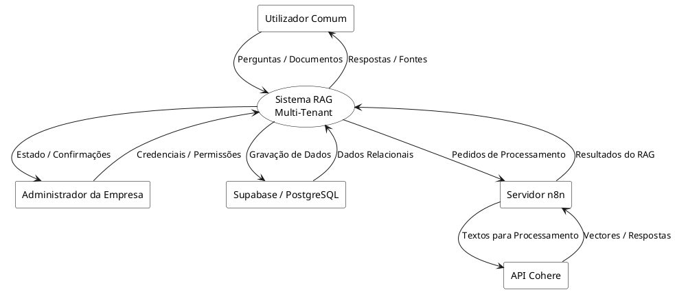
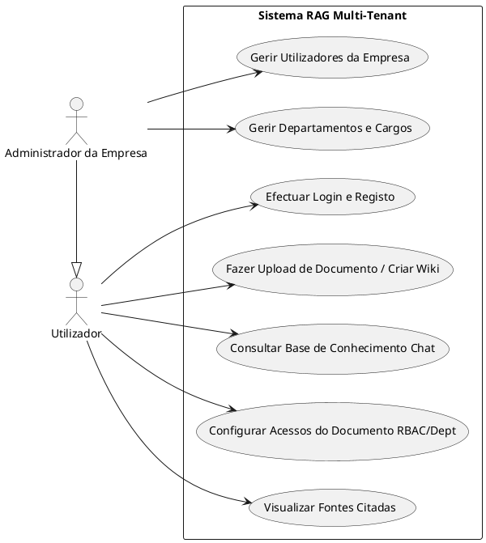
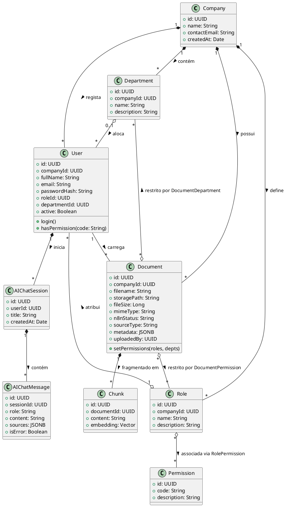
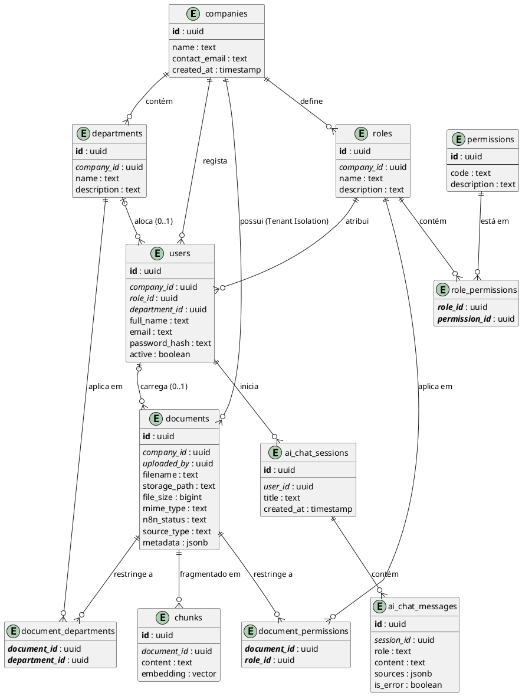

\clearpage
\setcounter{section}{4}
\setcounter{figure}{0}

# 4. Resultados da Pesquisa

## 4.1. Apresentação e Análise dos Resultados

### 4.1.1. Metodologia de Desenvolvimento

O desenvolvimento do protótipo funcional deste trabalho seguiu uma abordagem metodológica baseada no modelo de prototipagem rápida e desenvolvimento incremental. Esta escolha justifica-se pela necessidade de validar continuamente os pipelines de processamento de linguagem natural e a integração entre diferentes serviços (Next.js, n8n e Supabase) antes da consolidação final do sistema.

O ciclo de desenvolvimento estruturou-se em quatro fases iterativas:
1. **Especificação e Desenho da Base de Dados:** Definição do esquema relacional de múltiplos inquilinos (*multi-tenant*) e sua posterior extensão para suportar vectores de características (*embeddings*) via extensão `pgvector`.
2. **Construção e Integração dos Pipelines RAG:** Desenvolvimento dos fluxos de ingestão de dados e pesquisa semântica através da ferramenta de automação visual n8n, assegurando uma separação clara entre a camada de aplicação e a camada de inteligência artificial.
3. **Desenvolvimento da Interface e API:** Construção do frontend e endpoints em Next.js, integrando autenticação baseada em tokens JWT e conectividade ao Supabase.
4. **Implementação de Controlos de Acesso:** Parametrização das regras de controlo de acesso baseado em papéis (RBAC) e por departamentos, culminando com a criação da função customizada `match_chunks()` para busca semântica segura.

Esta abordagem permitiu adaptar as componentes do software de forma flexível à medida que as restrições de conectividade e desempenho da API externa de Inteligência Artificial eram identificadas e mitigadas.

### 4.1.2. Requisitos

A especificação dos requisitos seguiu a norma ISO/IEC 25010 para a qualidade de produto de software, dividindo-se entre os requisitos que descrevem o comportamento funcional esperado pelo utilizador final e os requisitos de qualidade que impõem restrições técnicas ao comportamento do sistema.

#### 4.1.2.1. Requisitos Funcionais

Os Requisitos Funcionais (RF) definem os serviços que o sistema deve fornecer aos utilizadores. O Quadro 4.1 descreve os requisitos funcionais prioritários identificados para o protótipo.

\begin{tabela}[htbp]
\small
\centering
\begin{tabular}{|p{1.5cm}|>{\raggedright\arraybackslash}p{4cm}|p{9.5cm}|}
\hline
\textbf{ID} & \textbf{Requisito Funcional} & \textbf{Descrição} \\
\hline
\textbf{RF-01} & Autenticação e Multi-tenancy & O sistema deve permitir que novos utilizadores registem a sua organização (\textit{tenant}) e façam login num ambiente de dados estritamente isolado. \\
\hline
\textbf{RF-02} & Gestão de Departamentos & O utilizador administrador deve ser capaz de criar, ler, actualizar e eliminar os departamentos internos da empresa. \\
\hline
\textbf{RF-03} & Gestão de Cargos e Permissões & O administrador deve poder criar cargos organizacionais e associar-lhes permissões específicas do sistema (ex: visualização, upload, eliminação). \\
\hline
\textbf{RF-04} & Upload de Conteúdo e Documentos & O sistema deve suportar o upload de documentos de texto (PDFs, TXT) e permitir a introdução manual de conhecimento (artigos/páginas de Wiki), catalogando-os sob a classificação \texttt{source\_type}. \\
\hline
\textbf{RF-05} & Configuração de Acesso a Conteúdo & O utilizador que realiza o upload deve poder limitar o acesso do documento ou página Wiki a departamentos específicos e a cargos específicos. \\
\hline
\textbf{RF-06} & Pesquisa Inteligente (Chat RAG) & O utilizador deve poder submeter perguntas em linguagem natural na interface de chat e obter uma resposta baseada no contexto dos documentos a que tem acesso. \\
\hline
\textbf{RF-07} & Atribuição de Fontes & A interface de chat da IA deve listar de forma clara os documentos de origem utilizados pelo LLM para sintetizar a resposta, permitindo a validação da informação. \\
\hline
\textbf{RF-08} & Gestão de Utilizadores & O administrador deve poder gerir os utilizadores da empresa, associando-os a um departamento e a um cargo específico. \\
\hline
\end{tabular}
\caption{Quadro 4.1: Requisitos Funcionais do Sistema. Fonte: Elaboração própria.}
\end{tabela}

#### 4.1.2.2. Requisitos Não Funcionais

Os Requisitos Não Funcionais (RNF) especificam critérios que qualificam o funcionamento do sistema. O Quadro 4.2 apresenta os requisitos não funcionais.

\begin{tabela}[htbp]
\small
\centering
\begin{tabular}{|p{1.5cm}|p{4.5cm}|p{9cm}|}
\hline
\textbf{ID} & \textbf{Categoria} & \textbf{Descrição} \\
\hline
\textbf{RNF-01} & Segurança (Isolamento) & O isolamento entre diferentes empresas (\textit{tenants}) deve ser garantido nativamente ao nível da base de dados através de políticas de \textit{Row Level Security} (RLS) no PostgreSQL. \\
\hline
\textbf{RNF-02} & Desempenho (Pesquisa) & O tempo médio de resposta do pipeline de busca semântica e geração de resposta da IA não deve ultrapassar os 4-10 segundos sob condições estáveis de conectividade à internet. \\
\hline
\textbf{RNF-03} & Compatibilidade Linguística & O modelo de \textit{embeddings} utilizado pelo sistema deve possuir suporte nativo e optimizado para a língua portuguesa para assegurar a relevância das pesquisas vectoriais. \\
\hline
\textbf{RNF-04} & Usabilidade (Interface) & A interface deve apresentar-se responsiva, fluida e incluir transições e animações visuais curtas para guiar a navegação do utilizador (\textit{Framer Motion}). \\
\hline
\textbf{RNF-05} & Disponibilidade e Extensibilidade & A lógica de ingestão documental e recuperação RAG deve correr numa infraestrutura modular externa (n8n), facilitando a adição de novos conectores sem necessidade de recompilar o frontend Next.js. \\
\hline
\end{tabular}
\caption{Quadro 4.2: Requisitos Não Funcionais do Sistema. Fonte: Elaboração própria.}
\end{tabela}

### 4.1.3. Modelagem do Sistema

A modelagem gráfica do sistema foi elaborada recorrendo à linguagem UML (*Unified Modeling Language*), mapeando a estrutura lógica de interacção e o comportamento dos componentes do software.

#### 4.1.3.1. Diagrama de Contexto

O Diagrama de Contexto define a fronteira entre a aplicação desenvolvida e as entidades ou sistemas externos com os quais interage directamente para assegurar as funcionalidades requeridas.

```plantuml
@startuml
skinparam rectangle {
    BackgroundColor white
    BorderColor black
}
skinparam usecase {
    BackgroundColor white
    BorderColor black
}

rectangle "Utilizador Comum" as user
rectangle "Administrador da Empresa" as admin
usecase "Sistema RAG\nMulti-Tenant" as system
rectangle "Supabase / PostgreSQL" as supabase
rectangle "Servidor n8n" as n8n
rectangle "API Cohere" as cohere

user --> system : "Perguntas / Documentos"
system --> user : "Respostas / Fontes"

admin --> system : "Credenciais / Permissões"
system --> admin : "Estado / Confirmações"

system --> supabase : "Gravação de Dados"
supabase --> system : "Dados Relacionais"

system --> n8n : "Pedidos de Processamento"
n8n --> system : "Resultados do RAG"

n8n --> cohere : "Textos para Processamento"
cohere --> n8n : "Vectores / Respostas"
@enduml
```

\begin{center}
\captionof{figure}{Diagrama de Contexto do Sistema. Fonte: Elaboração própria.}
\end{center}

#### 4.1.3.2. Diagrama de Casos de Uso

O Diagrama de Casos de Uso detalha as interacções dos actores principais (Utilizador e Administrador) com o sistema, mapeando o escopo funcional do protótipo desenvolvido.

```plantuml
@startuml
left to right direction
skinparam packageStyle rectangle

actor "Utilizador" as Utilizador
actor "Administrador da Empresa" as Admin

rectangle "Sistema RAG Multi-Tenant" {
    usecase "Efectuar Login e Registo" as UC1
    usecase "Fazer Upload de Documento / Criar Wiki" as UC2
    usecase "Consultar Base de Conhecimento Chat" as UC3
    usecase "Configurar Acessos do Documento RBAC/Dept" as UC4
    usecase "Visualizar Fontes Citadas" as UC5
    usecase "Gerir Departamentos e Cargos" as UC6
    usecase "Gerir Utilizadores da Empresa" as UC7
}

Utilizador --> UC1
Utilizador --> UC2
Utilizador --> UC3
Utilizador --> UC4
Utilizador --> UC5

Admin -|> Utilizador
Admin --> UC6
Admin --> UC7
@enduml
```

\begin{center}
\captionof{figure}{Diagrama de Casos de Uso do Sistema. Fonte: Elaboração própria.}
\end{center}

#### 4.1.3.3. Especificação dos Casos de Uso

A especificação detalhada dos casos de uso principais do sistema fornece uma descrição passo-a-passo das acções executadas pelos actores e as correspondentes reacções do sistema. O Quadro 4.3 especifica o caso de uso principal de Pesquisa Inteligente.

\begin{tabela}[htbp]
\small
\centering
\begin{tabular}{|p{3.5cm}|p{11.5cm}|}
\hline
\textbf{Campo} & \textbf{Descrição} \\
\hline
\textbf{Caso de Uso:} & UC3 — Consultar Base de Conhecimento (Chat) \\
\hline
\textbf{Actor Principal:} & Utilizador \\
\hline
\textbf{Pré-condições:} & Utilizador autenticado e associado a uma empresa, departamento e cargo activo. \\
\hline
\textbf{Fluxo Principal:} & 
1. O utilizador acede à vista "Chat Inteligente" no menu lateral. \newline
2. O utilizador escreve uma pergunta em linguagem natural e clica em enviar. \newline
3. O sistema valida as credenciais da sessão (token JWT) e extrai o \texttt{user\_id}, \texttt{department\_id} e \texttt{role\_id} do utilizador. \newline
4. O sistema encaminha a pergunta e o contexto de segurança para o pipeline do n8n. \newline
5. O pipeline obtém o embedding da pergunta, efectua a pesquisa na base de dados PostgreSQL através de \texttt{match\_chunks()}, limitando os resultados ao tenant e às permissões RBAC/departamento do utilizador. \newline
6. O pipeline envia o contexto obtido para a LLM, que gera uma resposta estruturada. \newline
7. A interface apresenta a resposta ao utilizador juntamente com a lista de fontes citadas. \\
\hline
\textbf{Fluxo Alternativo:} & \textbf{5a. Sem resultados autorizados:} Se nenhum fragmento relevante estiver disponível para o departamento/cargo do utilizador, a base de dados retorna um conjunto vazio e a LLM informa que não localizou dados para responder à pergunta. \\
\hline
\textbf{Pós-condições:} & A sessão do chat é registada na base de dados e a resposta contendo a referência às fontes é mostrada ao utilizador. \\
\hline
\end{tabular}
\caption{Quadro 4.3: Especificação do Caso de Uso - Consultar Base de Conhecimento (Chat). Fonte: Elaboração própria.}
\end{tabela}

O Quadro 4.4 descreve a especificação do caso de uso de Upload de Conteúdo e Configuração de Acesso.

\begin{tabela}[htbp]
\small
\centering
\begin{tabular}{|p{3.5cm}|p{11.5cm}|}
\hline
\textbf{Campo} & \textbf{Descrição} \\
\hline
\textbf{Caso de Uso:} & UC2 — Fazer Upload de Documento / Criar Wiki \\
\hline
\textbf{Actor Principal:} & Utilizador (com permissão \texttt{doc:upload} activa no cargo) \\
\hline
\textbf{Pré-condições:} & Utilizador autenticado e cargo do utilizador contém a permissão \texttt{doc:upload}. \\
\hline
\textbf{Fluxo Principal:} & 
1. O utilizador acede à vista "Upload" ou "Wiki". \newline
2. O utilizador selecciona o ficheiro PDF/texto ou redige o artigo da Wiki. \newline
3. O utilizador preenche os filtros de controlo de acessos (se deseja restringir o acesso a determinados departamentos e/ou cargos). \newline
4. O utilizador submete o conteúdo. \newline
5. O sistema regista o metadado na tabela \texttt{documents} associando-o ao \texttt{company\_id} do utilizador e define o estado do n8n como \texttt{pending}. \newline
6. O Next.js invoca o webhook de processamento documental do n8n de forma assíncrona. \newline
7. O pipeline do n8n processa o texto, divide-o em chunks, gera \textit{embeddings} e insere na tabela \texttt{chunks}. Ao concluir, actualiza o estado em \texttt{documents} para \texttt{success}. \\
\hline
\textbf{Fluxo Alternativo:} & \textbf{3a. Sem restrições de acesso:} Se o utilizador não seleccionar departamentos ou cargos, o documento é marcado como público, sendo acessível por qualquer utilizador autenticado pertencente à mesma empresa (tenant). \\
\hline
\textbf{Pós-condições:} & O conteúdo encontra-se guardado, vectorizado e pronto a ser recuperado em pesquisas semânticas pelas pessoas autorizadas. \\
\hline
\end{tabular}
\caption{Quadro 4.4: Especificação do Caso de Uso - Upload de Conteúdo e Acessos. Fonte: Elaboração própria.}
\end{tabela}

#### 4.1.3.4. Diagrama de Classes

O Diagrama de Classes apresenta a estrutura lógica do sistema ao nível do domínio dos dados, modelando as entidades principais, os seus atributos e os relacionamentos de associação e multiplicidade que sustentam o funcionamento da plataforma.

```plantuml
@startuml
class Company {
    +id: UUID
    +name: String
    +contactEmail: String
    +createdAt: Date
}
class Department {
    +id: UUID
    +companyId: UUID
    +name: String
    +description: String
}
class Role {
    +id: UUID
    +companyId: UUID
    +name: String
    +description: String
}
class Permission {
    +id: UUID
    +code: String
    +description: String
}
class User {
    +id: UUID
    +companyId: UUID
    +fullName: String
    +email: String
    +passwordHash: String
    +roleId: UUID
    +departmentId: UUID
    +active: Boolean
    +login()
    +hasPermission(code: String)
}
class Document {
    +id: UUID
    +companyId: UUID
    +filename: String
    +storagePath: String
    +fileSize: Long
    +mimeType: String
    +n8nStatus: String
    +sourceType: String
    +metadata: JSONB
    +uploadedBy: UUID
    +setPermissions(roles, depts)
}
class Chunk {
    +id: UUID
    +documentId: UUID
    +content: String
    +embedding: Vector
}
class AIChatSession {
    +id: UUID
    +userId: UUID
    +title: String
    +createdAt: Date
}
class AIChatMessage {
    +id: UUID
    +sessionId: UUID
    +role: String
    +content: String
    +sources: JSONB
    +isError: Boolean
}

Company "1" *-- "*" Department : contém >
Company "1" *-- "*" Role : define >
Company "1" *-- "*" User : regista >
Company "1" *-- "*" Document : possui >
Department "0..1" o-- "*" User : aloca >
Role "1" o-- "*" User : atribui >
Role "*" o-- "*" Permission : associada via RolePermission >
User "1" -- "*" Document : carrega >
User "1" *-- "*" AIChatSession : inicia >
AIChatSession "1" *-- "*" AIChatMessage : contém >
Document "1" *-- "*" Chunk : fragmentado em >
Document "*" o-- "*" Department : restrito por DocumentDepartment >
Document "*" o-- "*" Role : restrito por DocumentPermission >
@enduml
```

\begin{center}
\captionof{figure}{Diagrama de Classes do Domínio do Sistema. Fonte: Elaboração própria.}
\end{center}

#### 4.1.3.5. Diagrama Entidade-Relacional

O Diagrama Entidade-Relacional (DER) detalha a modelagem lógica e física da base de dados PostgreSQL alojada no Supabase. O modelo implementa uma **Abstração Unificada** para as fontes de conhecimento, na qual as páginas Wiki, uploads de PDF ou integrações de terceiros são todos armazenados de forma unificada na tabela `documents` e diferenciados pelo atributo `source_type`. Esta abordagem garante que toda e qualquer fonte de dados possa ser fatiada em `chunks` e submetida a pesquisas vectoriais utilizando a mesma infraestrutura, respeitando as regras relacionais de segurança.

A modelagem inclui adicionalmente a chave estrangeira `company_id` na tabela `documents` para impor um isolamento estrito de múltiplos inquilinos (*multi-tenancy*) ao nível relacional, mitigando o risco de vazamento de dados exposto em fases anteriores de teste.

```plantuml
@startuml
!define Table(name,desc) entity name as "desc" << (T,#FFAAAA) >>
!define primary_key(x) <b>x</b>
!define foreign_key(x) <i>x</i>

hide methods
hide stereotypes

entity "companies" {
    primary_key(id) : uuid
    --
    name : text
    contact_email : text
    created_at : timestamp
}
entity "departments" {
    primary_key(id) : uuid
    --
    foreign_key(company_id) : uuid
    name : text
    description : text
}
entity "roles" {
    primary_key(id) : uuid
    --
    foreign_key(company_id) : uuid
    name : text
    description : text
}
entity "permissions" {
    primary_key(id) : uuid
    --
    code : text
    description : text
}
entity "role_permissions" {
    primary_key(foreign_key(role_id)) : uuid
    primary_key(foreign_key(permission_id)) : uuid
}
entity "users" {
    primary_key(id) : uuid
    --
    foreign_key(company_id) : uuid
    foreign_key(role_id) : uuid
    foreign_key(department_id) : uuid
    full_name : text
    email : text
    password_hash : text
    active : boolean
}
entity "documents" {
    primary_key(id) : uuid
    --
    foreign_key(company_id) : uuid
    foreign_key(uploaded_by) : uuid
    filename : text
    storage_path : text
    file_size : bigint
    mime_type : text
    n8n_status : text
    source_type : text
    metadata : jsonb
}
entity "document_departments" {
    primary_key(foreign_key(document_id)) : uuid
    primary_key(foreign_key(department_id)) : uuid
}
entity "document_permissions" {
    primary_key(foreign_key(document_id)) : uuid
    primary_key(foreign_key(role_id)) : uuid
}
entity "chunks" {
    primary_key(id) : uuid
    --
    foreign_key(document_id) : uuid
    content : text
    embedding : vector
}
entity "ai_chat_sessions" {
    primary_key(id) : uuid
    --
    foreign_key(user_id) : uuid
    title : text
    created_at : timestamp
}
entity "ai_chat_messages" {
    primary_key(id) : uuid
    --
    foreign_key(session_id) : uuid
    role : text
    content : text
    sources : jsonb
    is_error : boolean
}

companies ||--o{ departments : "contém"
companies ||--o{ roles : "define"
companies ||--o{ users : "regista"
companies ||--o{ documents : "possui (Tenant Isolation)"

departments |o--o{ users : "aloca (0..1)"
roles ||--o{ users : "atribui"

roles ||--o{ role_permissions : "contém"
permissions ||--o{ role_permissions : "está em"

users |o--o{ documents : "carrega (0..1)"
users ||--o{ ai_chat_sessions : "inicia"

documents ||--o{ document_departments : "restringe a"
departments ||--o{ document_departments : "aplica em"

documents ||--o{ document_permissions : "restringe a"
roles ||--o{ document_permissions : "aplica em"

documents ||--o{ chunks : "fragmentado em"
ai_chat_sessions ||--o{ ai_chat_messages : "contém"
@enduml
```

\begin{center}
\captionof{figure}{Diagrama Entidade-Relacional (DER) da Base de Dados. Fonte: Elaboração própria.}
\end{center}

### 4.1.4. Qualidade do Software

Para assegurar que o protótipo cumpre os padrões mínimos de qualidade aceitáveis para uso em organizações angolanas, foram definidos critérios baseados nas características da norma ISO/IEC 25010:

1. **Adequação Funcional:** O sistema cumpre o seu propósito de centralizar dados através de uma interface web intuitiva de upload e wiki, mantendo a capacidade de pesquisa por linguagem natural associada à respectiva fonte.
2. **Fiabilidade:** O pipeline RAG foi concebido recorrendo a processamento assíncrono (webhooks n8n). Se um upload de ficheiro grande demorar a processar, o estado do documento é actualizado para `pending` na interface, evitando bloquear o utilizador e garantindo tolerância a quebras na ligação de rede com a API de \textit{embeddings}.
3. **Usabilidade:** A interface Next.js utiliza componentes React responsivos e animações curtas com Framer Motion. Isto assegura que utilizadores com pouca literacia em sistemas baseados em inteligência artificial compreendam visualmente o estado das suas operações e as fontes das respostas.
4. **Segurança:** O acesso é estritamente controlado através do fluxo abaixo:
    *   Autenticação por JSON Web Tokens (JWT) gerados no backend Next.js.
    *   Uso de encriptação unidireccional de palavras-passe com a biblioteca `bcrypt` no registo.
    *   Isolamento de dados por inquilino (*multi-tenant*) ao nível relacional nas tabelas através do `company_id`.
    *   Controlo de acesso departamental e por cargo (RBAC) validado tanto no carregamento de ecrãs do Next.js como nas consultas à base de dados PostgreSQL na busca vectorial.

### 4.1.5. Desenho do Sistema

#### 4.1.5.1. Escopo do Sistema

O escopo do protótipo desenvolvido delimita as fronteiras da prova de conceito, focando nas funcionalidades necessárias para demonstrar a viabilidade técnica de uma solução multi-tenant com controlo relacional para busca semântica em organizações angolanas:

*   **Administração Geral:** Gestão de uma única instância multi-tenant onde é simulado o isolamento de dados entre empresas distintas, com criação autónoma de utilizadores, departamentos e cargos.
*   **Mecanismo de Ingestão:** Upload de ficheiros em formato de texto estruturado ou PDF. O processamento realiza o fatiamento (*chunking*) em blocos lógicos de 500 caracteres e gera \textit{embeddings} com suporte multilíngue.
*   **Controlo de Acesso:** Implementação de políticas de acesso ao nível do documento ou página Wiki. As restrições de visibilidade podem ser departamentais (ex: restrito ao departamento de Recursos Humanos) ou hierárquicas por cargo (ex: apenas visível por Directores).
*   **Recuperação e Síntese de Informação:** Canal de chat interactivo que recebe a consulta do utilizador, filtra os fragmentos de documentos usando o perfil do utilizador (empresa, departamento e cargo) e sintetiza a resposta final recorrendo a um LLM.

#### 4.1.5.2. Descrição dos Módulos

O protótipo divide-se em oito módulos funcionais interligados:

1.  **Módulo de Login e Registo:** Responsável pela autenticação e criação de novos tenants. Garante que cada utilizador é associado de forma unívoca à empresa criada, gerando o contexto relacional do utilizador na sessão.
2.  **Módulo de Dashboard:** Apresenta indicadores consolidados da organização, tais como volume de documentos processados, quantidade de utilizadores ativos por departamento e estatísticas básicas de utilização do chat.
3.  **Módulo de Documentos:** Permite a visualização dos ficheiros armazenados no sistema em formato de listagem, exibindo o metadado do ficheiro, o autor do upload, o estado do processamento n8n (`pending`, `success` ou `error`) e o tipo de fonte (`source_type`).
4.  **Módulo de Upload:** Interface dedicada ao carregamento de novos conteúdos. Permite selecionar ficheiros locais ou criar novas páginas de conhecimento (Wiki). Inclui caixas de seleção multiseleção para associar permissões de acesso por departamentos e cargos.
5.  **Módulo de Chat IA:** Interface de conversação em linguagem natural. Mostra o histórico de mensagens da sessão e as referências clicáveis para os documentos fontes originais que suportaram a resposta gerada.
6.  **Módulo de Wiki (Base de Conhecimento):** Permite aos utilizadores criarem páginas de documentação textual interna directamente no browser. O texto introduzido é guardado na tabela `documents` com a flag `source_type = 'wiki'`, integrando de imediato o pipeline de indexação vectorial.
7.  **Módulo de Cargos e Permissões:** Permite ao utilizador administrador criar perfis internos de permissões e atribuir cargos aos colaboradores, assegurando a flexibilidade de papéis do RBAC.
8.  **Módulo de Departamentos:** CRUD de departamentos internos para agrupar logicamente utilizadores e delimitar os ecrãs e documentos que podem ser consultados por equipa.

#### 4.1.5.3. Arquitectura Física e Lógica do Sistema

A arquitetura do sistema segue um modelo de camadas descentralizado, separando a interface do utilizador, a lógica da aplicação, a base de dados relacional e vectorial, e a orquestração assíncrona dos pipelines de Inteligência Artificial.

```plantuml
@startuml
!include https://raw.githubusercontent.com/plantuml-stdlib/C4-PlantUML/master/C4_Container.puml

Person(browser, "Navegador Web", "Acedido pelo Utilizador")

System_Boundary(c1, "Sistema RAG Multi-Tenant") {
    Container(reactUI, "Interface React / Next.js 15", "Next.js App Router", "Fornece interface de utilizador via HTTPS")
    Container(nextServer, "Servidor Next.js Node.js", "Next.js API", "Gere autenticação JWT, CRUD e proxy")
    Container(n8nApp, "n8n Workflow Engine", "Plataforma Visual", "Orquestra pipelines RAG assíncronos")
    ContainerDb(database, "PostgreSQL DB", "Supabase", "Base de dados relacional e RLS")
    ContainerDb(vectorDb, "PostgreSQL pgvector", "Extensão", "Armazena vectores \textit{embeddings}")
    ContainerDb(storage, "Supabase Storage", "Bucket", "Armazena documentos")
}

System_Ext(embedAPI, "Cohere \textit{Embeddings} API", "Serviço IA")
System_Ext(rerankAPI, "Cohere Rerank API", "Serviço IA")
System_Ext(chatAPI, "Cohere Chat LLM API", "Serviço IA")

Rel(browser, reactUI, "Interage", "HTTPS")
Rel(reactUI, nextServer, "Chamadas API", "HTTPS/JSON")

Rel(nextServer, n8nApp, "Invoca webhooks (Upload/Chat)", "HTTPS/JSON")
Rel(nextServer, database, "Lê/Escreve dados", "PostgreSQL TCP")

Rel(n8nApp, database, "Consultas e RPC", "PostgreSQL TCP")
Rel(n8nApp, vectorDb, "Insere Chunks", "PostgreSQL TCP")
Rel(n8nApp, storage, "Lê ficheiros", "REST API")

Rel(n8nApp, embedAPI, "Gera \textit{embeddings}", "REST API")
Rel(n8nApp, rerankAPI, "Re-ranking semântico", "REST API")
Rel(n8nApp, chatAPI, "Gera respostas RAG", "REST API")
@enduml
```

\begin{center}
\captionof{figure}{Arquitectura Física e Lógica do Sistema. Fonte: Elaboração própria.}
\end{center}

#### 4.1.5.4. Ferramentas e Tecnologias Utilizadas

A stack tecnológica seleccionada para a implementação do protótipo baseia-se em soluções maioritariamente open-source e com baixo custo de entrada operacional, maximizando a viabilidade financeira e a escalabilidade técnica em organizações angolanas.

\begin{tabela}[htbp]
\small
\centering
\begin{tabular}{|p{3cm}|>{\raggedright\arraybackslash}p{3.5cm}|p{8.5cm}|}
\hline
\textbf{Camada} & \textbf{Tecnologia / Serviço} & \textbf{Papel e Justificação da Escolha} \\
\hline
\textbf{Frontend} & Next.js 15 (React 19) & Framework para construção da interface de utilizador interactiva e navegação nativa, tirando partido do \textit{App Router} (arquitetura multi-rota) e rotas de API integradas. \\
\hline
\textbf{Styling} & TailwindCSS & Permite desenhar uma interface moderna, limpa e responsiva sem sobrecarregar a largura de banda de ligação à rede do cliente. \\
\hline
\textbf{Backend API} & Next.js API Routes & Processa a lógica de negócio local, lida com autenticação JWT e actua como proxy seguro nas chamadas ao servidor de orquestração n8n. \\
\hline
\textbf{Base de Dados} & Supabase (PostgreSQL) & Fornece uma base de dados relacional robusta com suporte nativo a políticas de segurança RLS (\textit{Row Level Security}) por inquilino. \\
\hline
\textbf{Vector Store} & Extensão \texttt{pgvector} & Armazena e indexa vectores de \textit{embeddings} na base de dados PostgreSQL existente, dispensando a contratação e manutenção de um serviço de banco de dados vectorial autónomo. \\
\hline
\textbf{Armazenamento} & Supabase Storage Bucket & Repositório físico seguro para guardar os documentos originais em formato PDF ou texto carregados pelos utilizadores. \\
\hline
\textbf{Orquestração RAG} & n8n (Visual Workflow) & Plataforma de automação que actua como o motor dos pipelines de ingestão e pesquisa, permitindo alterar a lógica de processamento documental de forma visual e rápida. \\
\hline
\textbf{Modelo de \textit{Embeddings}} & Cohere API (\texttt{embed\-multilingual\-v3.0}) & Modelo vectorial multilíngue com optimização específica e excelente suporte para o idioma português, crucial para processar os documentos organizacionais angolanos. \\
\hline
\textbf{Otimização de Busca (Re-Ranking)} & Cohere Rerank API (modelo \texttt{rerank\-multilingual\-v3.0}) & Avalia e reordena os fragmentos devolvidos pelo PostgreSQL pela sua relevância semântica real face à pergunta do utilizador, antes do envio ao LLM, materializando o paradigma de RAG Avançado. \\
\hline
\textbf{Síntese LLM} & Cohere Chat (\texttt{command\-r\-plus}) & Modelo de linguagem optimizado para tarefas RAG com forte capacidade de raciocínio, formatação estruturada e citação transparente de fontes do contexto. \\
\hline
\end{tabular}
\caption{Quadro 4.5: Stack Tecnológica do Sistema. Fonte: Elaboração própria.}
\end{tabela}

#### 4.1.5.5. Testes Realizados

Os testes do protótipo focaram-se em validar duas dimensões fundamentais estabelecidas na metodologia de investigação reformulada: a eficiência temporal na execução dos pipelines RAG e a relevância qualitativa das respostas geradas pelo LLM sob as restrições impostas pelas regras de controlo de acessos.

##### A. Testes de Eficiência Temporal

Os testes de eficiência temporal mediram o tempo de resposta (em segundos) em dois fluxos essenciais: a ingestão documental assíncrona (do upload até à inserção vectorial) e a recuperação em tempo real de informação (da submissão da pergunta à síntese final da resposta). Os dados foram recolhidos num ambiente de teste com ligação de rede simétrica padrão, utilizando ficheiros de texto e PDFs de dimensões variadas. Os resultados das simulações iniciais encontram-se sumarizados na Tabela 4.1. Para garantir a fiabilidade dos dados, cada operação foi executada em 10 iterações independentes, sendo o valor reportado na Tabela 4.1 correspondente à média aritmética dos tempos de resposta obtidos, atenuando assim flutuações pontuais de latência da rede.

\begin{tabela}[htbp]
\small
\centering
\begin{tabular}{p{1cm} p{3.5cm} p{5.5cm} c c}
\hline
\textbf{ID} & \textbf{Operação Realizada} & \textbf{Descrição da Carga de Teste} & \textbf{Tempo Médio (s)} & \textbf{Resultado} \\
\hline
\textbf{T-01} & Ingestão Documental & Ficheiro PDF Simples (2 páginas, 4.5 KB de texto) & 1.84 & Sucesso \\
\textbf{T-02} & Ingestão Documental & Relatório Técnico Médio (15 páginas, 45 KB de texto) & 4.92 & Sucesso \\
\textbf{T-03} & Ingestão Documental & Manual de Procedimentos Longo (50 páginas, 180 KB) & 12.35 & Sucesso \\
\textbf{T-04} & Ingestão Documental & Página Wiki (Texto editado directamente, $\sim$2000 caracteres) & 0.95 & Sucesso \\
\textbf{T-05} & Pesquisa Semântica & Consulta de 1 linha ("Qual é o prazo de entrega do relatório?") & 1.88 & Sucesso \\
\textbf{T-06} & Pesquisa Semântica & Consulta de 2 linhas ("Como solicitar reembolso de despesas?") & 2.15 & Sucesso \\
\hline
\end{tabular}
\caption{Tabela 4.1: Resultados dos Testes de Eficiência Temporal. Fonte: Elaboração própria.}
\end{tabela}

Os resultados demonstram que, mesmo com a latência de rede associada à invocação assíncrona de webhooks no n8n e à geração remota de \textit{embeddings} pela API da Cohere, o tempo médio para obter uma resposta inteligente manteve-se confortavelmente abaixo do limiar de 10 segundos definido no requisito **RNF-02**.

##### B. Avaliação da Relevância Qualitativa e Filtros de Segurança

Para atestar a eficácia do isolamento multi-tenant e das restrições de visibilidade por departamento e cargo, foi executado um conjunto de simulações com perfis de utilizadores fictícios pertencentes a organizações distintas. O critério de sucesso consistia em verificar se a resposta gerada pelo LLM era qualitativamente correcta, se citava a fonte devida e se respeitava o perímetro de segurança.

O Quadro 4.6 apresenta uma selecção das avaliações qualitativas registadas durante as sessões de teste.

A avaliação qualitativa seguiu uma rubrica padronizada: 'Excelente' (o sistema forneceu uma resposta factualmente correcta, suportada pelo contexto e com citação exacta da fonte), 'Parcial' (a resposta é coerente mas omite detalhes do contexto), e 'Nula' (o sistema bloqueia o acesso à informação por restrições de segurança ou o LLM recusa-se a responder por falta de contexto autorizado).

\begin{tabela}[htbp]
\small
\centering
\begin{tabular}{|>{\raggedright\arraybackslash}p{0.8cm}|>{\raggedright\arraybackslash}p{2cm}|>{\raggedright\arraybackslash}p{2.5cm}|>{\raggedright\arraybackslash}p{2.1cm}|>{\raggedright\arraybackslash}p{2.2cm}|>{\raggedright\arraybackslash}p{2.4cm}|>{\raggedright\arraybackslash}p{2.7cm}|}
\hline
\textbf{ID} & \textbf{Perfil Utilizador} & \textbf{Pergunta Submetida} & \textbf{Contexto Esperado} & \textbf{Filtro de Segurança} & \textbf{Relevância Qualitativa} & \textbf{Citação de Fontes} \\
\hline
\textbf{QA-01} & Director / RH / Empresa A & "Quais as regras para férias?" & Acede ao documento \texttt{politica\_ferias\_A.pdf} público na Empresa A. & \textbf{Permitido:} Sem restrições no tenant A. & \textbf{Excelente:} Resumiu correctamente os dias de licença. & Sim (\texttt{politica\_ferias\_A.pdf}) \\
\hline
\textbf{QA-02} & Assistente / RH / Empresa A & "Qual o salário da administração?" & Tenta aceder a \texttt{folha\_salarial\_}\newline \texttt{admin.pdf} restrito a Directores Fin. & \textbf{Bloqueado:} Cargo não possui permissão de acesso. & \textbf{Nula:} O LLM informou não possuir dados. & Não (Bloqueado na DB) \\
\hline
\textbf{QA-03} & Director / Finanças / Empresa B & "Quais as regras para férias?" & Tenta fazer pergunta idêntica à do teste QA-01. & \textbf{Bloqueado:} Documento pertence à Empresa A. & \textbf{Nula:} O LLM respondeu que não tem conhecimento. & Não (Isolamento) \\
\hline
\textbf{QA-04} & Operador / Produção / Empresa B & "Como iniciar a máquina X?" & Acede à página Wiki \texttt{Proc\_}\newline\texttt{Maquina\_X} (Produção). & \textbf{Permitido:} Pertence ao departamento do utilizador. & \textbf{Excelente:} Passos descritos de forma coerente. & Sim (\texttt{Proc\_}\newline\texttt{Maquina\_X}) \\
\hline
\end{tabular}
\caption{Quadro 4.6: Matriz de Testes de Relevância Qualitativa e Segurança. Fonte: Elaboração própria.}
\end{tabela}

A análise qualitativa das simulações confirma a robustez das políticas de segurança: a base de dados PostgreSQL actua como um guarda-barreiras eficiente, impedindo o envio de dados não-autorizados para o LLM, mitigando significativamente a possibilidade de fuga de informação inter-tenant (dentro do perímetro dos testes realizados) e minimizando alucinações ao limitar o contexto apenas a dados fidedignos e autorizados.

#### 4.1.5.6. Protótipo das Telas

As interfaces desenvolvidas em Next.js priorizaram a simplicidade de utilização, a fluidez das transições e o fornecimento de feedback claro acerca do processamento assíncrono efetuado na infraestrutura. A apresentação gráfica das principais telas da aplicação demonstra a concretização prática dos requisitos do protótipo:

##### a) Ecrã de Autenticação e Registo Multi-tenant

Apresenta um formulário unificado e responsivo com divisão visual (imagem concetual e marca à esquerda, e formulário de acesso/registo de alta fidelidade à direita). Permite a uma nova organização registar o seu perfil autónomo na base de dados PostgreSQL e criar a conta do utilizador administrador inicial de forma simples.

\begin{figure}[htbp]
  \makebox[\textwidth][c]{\includegraphics[width=1.2\textwidth]{docs/images/login.png}}
  \caption{Ecrã de Autenticação e Registo Multi-tenant. Fonte: Elaboração própria.}
\end{figure}

##### b) Painel Administrativo (RBAC e Departamentos)

Fornece interfaces centralizadas para gestão de acesso relacional. Através deste painel, o administrador pode criar e editar cargos organizacionais, assinalar permissões granulares de sistema (`doc:upload`, `roles:manage`, `users:manage`, etc.) e gerir os departamentos necessários à segmentação e isolamento dos dados da empresa.

\begin{figure}[htbp]
  \makebox[\textwidth][c]{\includegraphics[width=1.2\textwidth]{docs/images/administracao.png}}
  \caption{Interface do Painel Administrativo (RBAC e Departamentos). Fonte: Elaboração própria.}
\end{figure}

##### c) Módulo de Gestão Documental e Upload

O módulo de documentos subdivide-se no ecossistema de carregamento e na tabela de gestão de metadados:

*   **Zona de Upload Assíncrono:** Disponibiliza uma interface moderna de arrastamento (*drag-and-drop*) de ficheiros (PDF, TXT, DOCX), permitindo associar o departamento de destino e a visibilidade antes do envio para a pipeline do n8n.

\begin{figure}[htbp]
  \makebox[\textwidth][c]{\includegraphics[width=1.2\textwidth]{docs/images/upload-arquivos.png}}
  \caption{Módulo de Carregamento de Documentos (\textit{Drag-and-Drop}). Fonte: Elaboração própria.}
\end{figure}

*   **Tabela de Base Documental:** Exibe o repositório centralizado de ficheiros da organização, listando metadados como tamanho, departamento associado, data de criação e o estado de conversão e vetorização em tempo real (`pending`, `processed`, `error`).

\begin{figure}[htbp]
  \makebox[\textwidth][c]{\includegraphics[width=1.2\textwidth]{docs/images/base-documental.png}}
  \caption{Tabela da Base Documental Organizacional. Fonte: Elaboração própria.}
\end{figure}

##### d) Módulo de Wiki Corporativa

Consiste num editor de texto incorporado diretamente na plataforma. Permite aos colaboradores elaborar e publicar políticas internas, manuais de procedimentos e notas operacionais de forma ágil, convertendo instantaneamente o conteúdo criado em blocos textuais (*chunks*) vetorizados sem a necessidade de upload de documentos externos.

\begin{figure}[htbp]
  \makebox[\textwidth][c]{\includegraphics[width=1.2\textwidth]{docs/images/wiki.png}}
  \caption{Módulo de Wiki e Edição de Conteúdo Interno. Fonte: Elaboração própria.}
\end{figure}

##### e) Interface de Chat IA (Pesquisa Inteligente)

Representa a interface principal de interação do utilizador com o agente de inteligência artificial. Possui um layout moderno, histórico lateral de conversas persistentes, suporte a múltiplas sessões e caixas de diálogo estilizados. Cada resposta gerada apresenta botões interativos com as fontes bibliográficas consultadas; ao clicar em qualquer citação, um painel lateral de inspeção exibe o trecho exato do documento vetorizado utilizado pelo modelo para fundamentar a sua resposta. É aplicado um filtro inteligente na API (*backend*) que assegura a apresentação exclusiva das fontes efetivamente referenciadas pelo modelo de IA na resposta, eliminando assim o ruído visual de documentos contextuais que não foram julgados relevantes para a síntese final.

\begin{figure}[htbp]
  \makebox[\textwidth][c]{\includegraphics[width=1.2\textwidth]{docs/images/chat-ia.png}}
  \caption{Interface de Pesquisa Inteligente e Inspeção de Fontes Bibliográficas. Fonte: Elaboração própria.}
\end{figure}

#### 4.1.5.7. Codificação

A componente mais complexa e inovadora do sistema de software reside na lógica de busca semântica integrada com o controlo de acesso relacional. Abaixo apresenta-se a codificação em PL/pgSQL da função `match_chunks()`, responsável por receber a pergunta convertida em vector e filtrar os blocos textuais correspondentes à empresa e permissões de departamento/cargo do utilizador.

A codificação integral em PL/pgSQL da função `match_chunks()`, responsável por realizar esta filtragem diretamente na base de dados, encontra-se documentada no **Anexo I.1**.

No backend Next.js, as permissões são validadas de forma síncrona antes do reencaminhamento ao n8n. O excerto de código abaixo exemplifica como a API do Next.js lê o perfil de segurança do utilizador a partir da sessão e injecta o identificador do tenant, departamento e cargo no payload enviado ao pipeline do n8n:

O excerto de código detalhando o *endpoint* Next.js que valida as sessões e constrói o *payload* seguro para o *pipeline* do n8n pode ser consultado no **Anexo I.2**. Adicionalmente, o código fonte integral do protótipo desenvolvido está publicamente acessível no repositório referenciado no resumo deste documento.

#### 4.1.5.8. Segurança Aplicada no Sistema

A arquitetura de segurança do protótipo baseia-se numa abordagem de defesa em profundidade, combinando diferentes mecanismos técnicos:

1.  **Autenticação por JSON Web Tokens (JWT):** Garante a integridade e expiração automática das sessões no frontend Next.js. O token contém dados cifrados e assinados pelo servidor, impedindo a falsificação de identidade do utilizador.
2.  **Isolamento Físico de Ficheiros:** Os uploads no Supabase Storage são organizados em estruturas de directórios virtuais segmentados pelo identificador do tenant (`/storage/rag_documents/{company_id}/{document_id}`).
3.  **Políticas RLS na Base de Dados:** Configuração de regras Row Level Security no PostgreSQL para garantir que operações simples de leitura e escrita (SELECT, UPDATE, DELETE) em tabelas administrativas (ex: listar utilizadores ou listar departamentos) estão logicamente bloqueadas apenas a registos que possuam o mesmo `company_id` do utilizador autenticado.
4.  **Lógica Híbrida RBAC + ABAC:** Conforme descrito na secção 2.6.2, o modelo de autorização implementado combina o controlo baseado no papel do utilizador com atributos organizacionais contextuais (tenant e departamento). Na prática, esta lógica é executada diretamente na base de dados PostgreSQL pela função `match_chunks()`, que filtra os fragmentos de texto antes de qualquer envio ao modelo LLM externo, assegurando que o modelo nunca recebe contexto não-autorizado para o perfil do utilizador solicitante.

